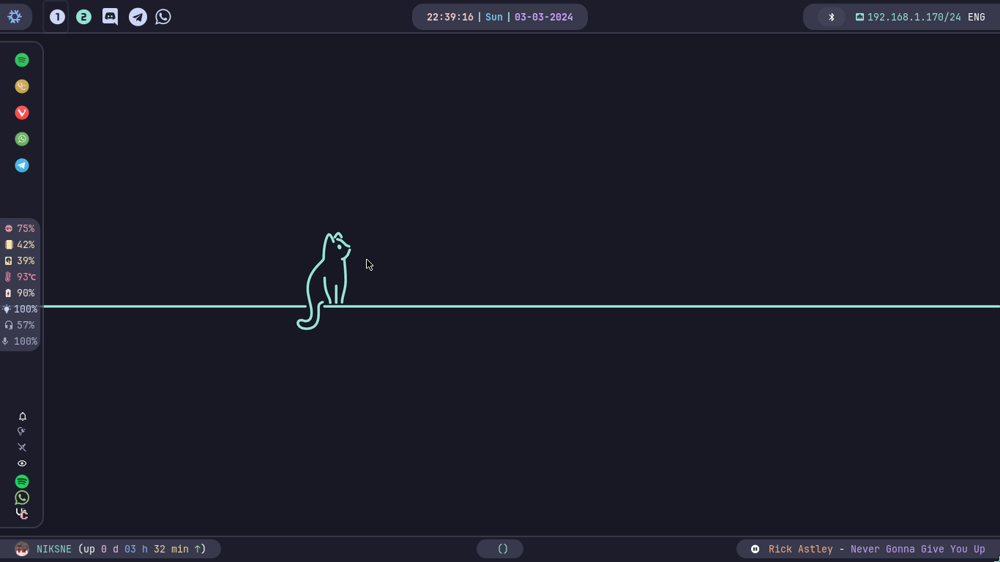
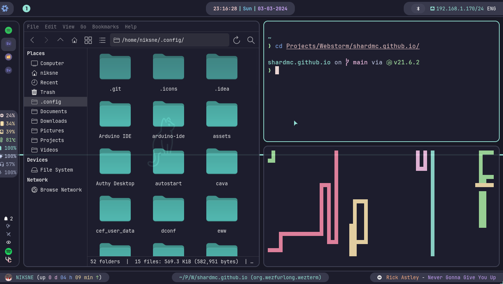
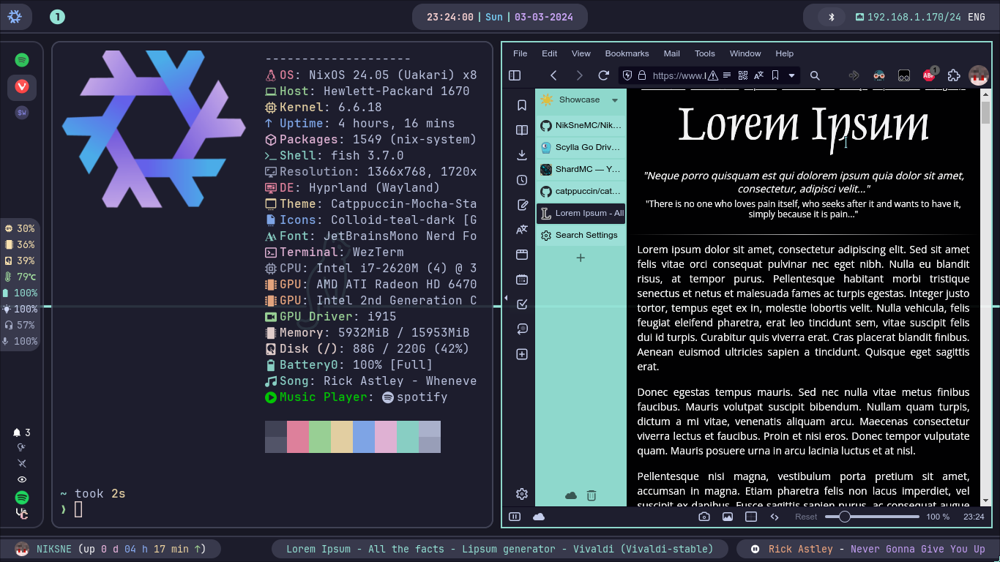
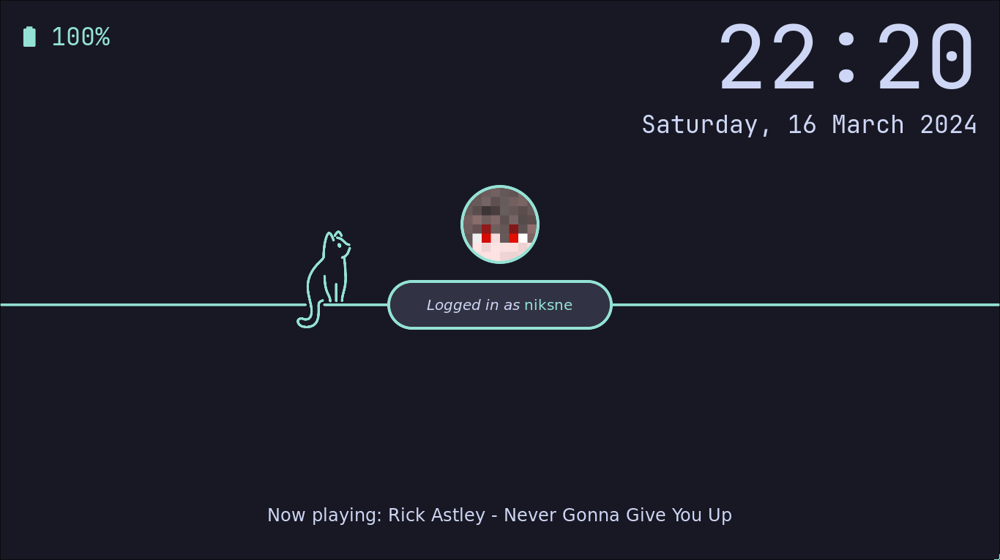

<h1 align="center">NixOS & Hyprland with Catppuccin Mocha Theme Configuration</h1>

## Table of Contents
- [About](#-about)
- [Showcase](#-showcase)
- [Components](#-components)
- [Roadmap](#-roadmap)
- [Installation](#-installation)
- [Keybindings](#️-keybindings)
- [License](#-license)

## 🌟 Showcase

> [!NOTE] 
> Showcase images may be outdated

## 🔧 Components

| Component        | Version/Name                         |
|------------------|--------------------------------------|
| Distro           | NixOS                                |
| Shell            | Fish                                 |
| Display Server   | Wayland                              |
| WM (Compositor)  | Hyprland                             |
| Theme            | Catppuccin Mocha                     |
| Boot Loader      | Grub (themed)                        |
| Graphical Boot   | Plymouth (themed)                    |
| Font             | JetBrains Mono + Nerd Font Patch     |
| Terminal         | WezTerm + Starship (themed)          |
| Bar              | Waybar (themed)                      |
| Notification     | SwayNotificationCenter (themed)      |
| Launcher         | Rofi-Wayland (themed)                |
| Editor           | NVChad, VSCodium (themed)            |
| Night Gamma      | Gammastep                            |
| Fetch Utility    | Neofetch, Cpufetch                   |
| File Browser     | Thunar (themed)                      |
| Internet Browser | Vivaldi (themed)                     |
| Screenshot       | GrimBlast + Slurp                    |
| Recorder         | Wf-recorder                          |
| Color Picker     | Hyprpicker                           |
| Clipboard        | Wl-clipboard + Cliphist              |
| Idle             | Hypridle                             |
| Lock             | Hyprlock (themed)                    |
| Logout menu      | Wlogout (themed)                     |
| Wallpaper        | swww                                 |
| Player           | Spotify (themed)                     |
| Messengers       | Vesktop, Telegram, Whatsapp (themed) |

## 📈 Roadmap

1. Switch to Home Manager
2. More configurable installation
3. Finally fix Scylladb

## 🚀 Installation

1. Download and Install NixOS from the [official site](https://nixos.org/download) (I reccomend installation without graphics).
2. Temporarily enable flakes and install git and curl using the command: `nix-shell --experimental-features 'nix-command flakes' -p git curl`.
3. Run installation script: `source <(curl -s https://github.com/NikSneMC/NikSOS/raw/main/install.sh)`.
4. For an even more consistent experience across your apps, you can import Catppuccin theme config files into certain programs through their graphical user interfaces. This includes:

 - Websites in your browser (Vivaldi):
   - Install the Stylus Extension from its [official website](https://add0n.com/stylus.html).
   - Open the extension's settings page and navigate to the Backup section.
   - Click "Import" and select the file `stylus-catppuccin.json`.
 - DuckDuckGo in any browser:
   - Follow the [official guide](https://github.com/catppuccin/duckduckgo) provided by Catppuccin.
  
## ⌨️ Keybindings

> [!TIP] 
> SUPER is key with Windows logo (Windows keyboards) or OPTION key (Apple keyboards)

### Windows

| Key Combination                       | Action                 |
|---------------------------------------|------------------------|
| F11                                   | Toggle full-screen     |
| SUPER + F                             | Toggle floating window |
| SUPER + J                             | Toggle split           |
| SUPER + P                             | Toggle pseudo          |
| SUPER + up, down, left, right         | Change window focus    |
| SUPER + SHIFT + Q                     | Kill active window     |
| SUPER + SHIFT + up, down, left, right | Move window            |

### Workspaces
| Key Combination            | Action                                        |
|----------------------------|-----------------------------------------------|
| SUPER + 1..0               | Change workspace (numbered)                   |
| SUPER + F1..F12            | Change workspace (iconed)                     |
| SUPER + MOUSE_UP           | Go to the previous workspace                  |
| SUPER + MOUSE_DOWN         | Go to the next workspace                      |
| SUPER + SHIFT + 1..0       | Move window to workspace and change workspace |
| SUPER + SHIFT + ALT + 1..0 | Move window to workspace                      |

### Utils

| Key Combination | Action                                            |
|-----------------|---------------------------------------------------|
| SUPER + A       | Open application (`rofi -drun`)                   |
| SUPER + B       | Launch `vivaldi`                                  |
| SUPER + D       | Launch `vesktop`                                  |
| SUPER + E       | Launch `thunar`                                   |
| SUPER + G       | Launch `github-desktop`                           |
| SUPER + L       | Launch `hyprlock`                                 |
| SUPER + N       | Open notification list (`swaync-client -t`)       |
| SUPER + R       | Run command (`rofi -run`)                         |
| SUPER + T       | Launch `wezterm`                                  |
| SUPER + V       | Open clipboard (`rofi -dmenu`)                    |
| SUPER + W       | Open window movement item menu using `pyprland`   |
| SUPER + X       | Open clipboard deletion item menu (`rofi -dmenu`) |
| SUPER + ;       | Open emoji picker (`rofi -dmenu`)                 |
| SUPER + ESC     | Launch `wlogout`                                  |

### Utils with SHIFT modifier

| Key Combination   | Action                                      |
|-------------------|---------------------------------------------|
| SUPER + SHIFT + A | Open 2fa code menu (`rofi -dmenu`)          |
| SUPER + SHIFT + C | Launch color picker (using `hyperpicer`)    |
| SUPER + SHIFT + E | Exit from `hyprland`                        |
| SUPER + SHIFT + F | Open rofi filebrowser (`rofi -filebrowser`) |
| SUPER + SHIFT + G | Record screen area (GIF)                    |
| SUPER + SHIFT + N | Toggle notifications (`swaync-client -d`)   |
| SUPER + SHIFT + R | Record screen area (MP4)                    |
| SUPER + SHIFT + S | Take screenshot                             |
| SUPER + SHIFT + T | Launch `telegram-desktop`                   |
| SUPER + SHIFT + V | Launch `codium`                             |
| SUPER + SHIFT + W | Launch `whatsapp-for-linux`                 |
| SUPER + SHIFT + X | Clear clipboard                             |

### Scratchpads

| Key Combination   | Action                                                |
|-------------------|-------------------------------------------------------|
| SUPER + CTRL + M  | Launch scratchpad with `spotify` using `pyprland`     |
| SUPER + CTRL + T  | Launch scratchpad with `wezterm` using `pyprland`     |
| SUPER + CTRL + V  | Launch scratchpad with `pavucontrol` using `pyprland` |

### Reload scripts

| Key Combination        | Action            |
|------------------------|-------------------|
| SUPER + CTRL + ALT + B | Reload `waybar`   |
| SUPER + CTRL + ALT + N | Reload `swaync`   |
| SUPER + CTRL + ALT + P | Reload `pyprland` |
| SUPER + CTRL + ALT + W | Reload `swww`     |

You can find all other keybindings in `hypr/hyprland.conf` in the bind section. All system fish scripts are located at `fish/functions` directory.

## 📜 License

This project is licensed under the AGPL-3.0 License - see the [LICENSE](LICENSE) file for details.
